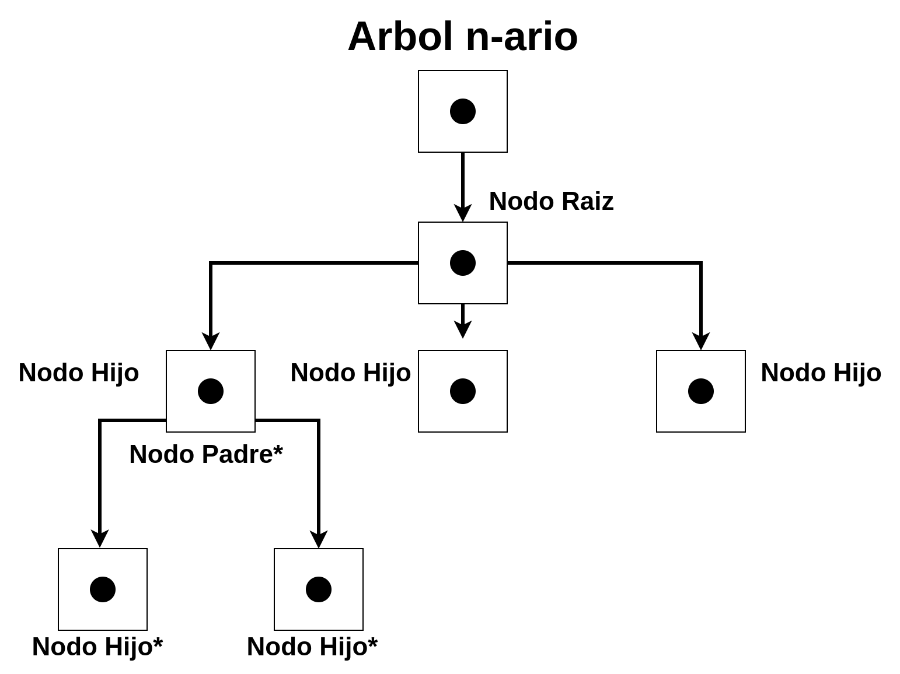
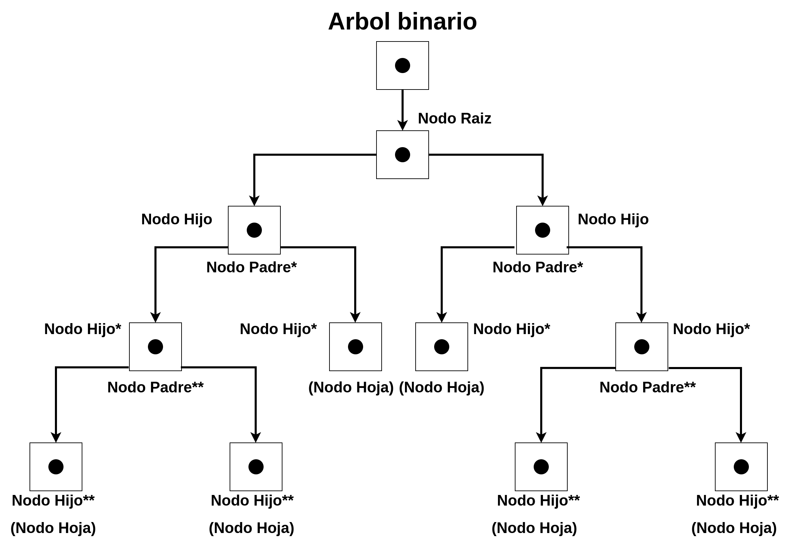
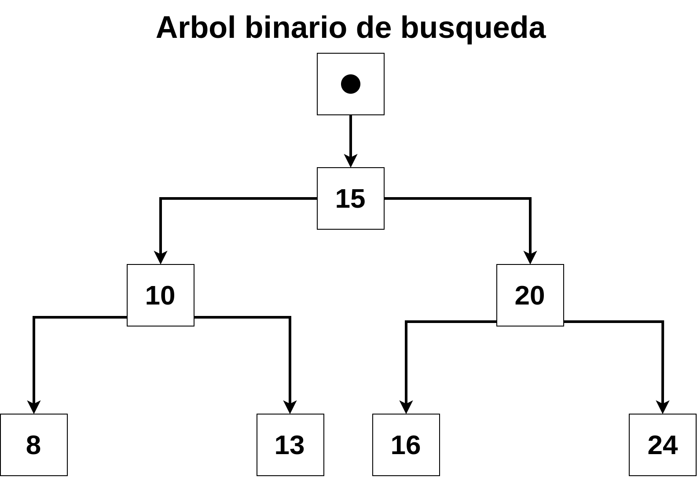

# TDA ABB

## Repositorio de (Sebastian Furnier) - (110129) - (sfurier@fi.uba.ar)

- Para compilar:

```bash
make tp-compilar
```

- Para ejecutar:

```bash
make tp-correr
```

- Para ejecutar con valgrind:
```bash
make tp-valgrind
```
---
##  Funcionamiento

En este TP usamos una estructura de arbol binario de busqueda (ABB) para almacenar datos de forma ordenada, lo que facilitara la busqueda de los mismos. Para desarrollar el arbol se usaron 2 estructuras, una para definir el arbol y otra para los nodos que van a componer cada rama.

La estructura usada para el arbol consta de un nodo raiz (el cual nos servira de nodo inicial para ingresar datos, buscarlos, eliminarlos), un comparador y una variable tamanio que reflejara la cantidad de nodos ingresados contando la raiz. El comparador es una funcion que sera creada y guardada por el usuario de las funciones privadas que componen el TP. Se espera que dicho comparador devuelva valores mayores a cero si el elemento que se compara sea mayor al guardado en el nodo que se esta evaluando, menor a cero si dicho elemento es menor al guardado en el nodo comparado y cero si son iguales.

Las estructuras de los nodos guardan un puntero a un elemento de cualquier tipo y 2 punteros a otros nodos, izquierda y derecha. Por convencion se toma que los elementos ingresados que sean menores al guardado en el nodo raiz, se "acomodaran" hacia el lado izquierdo y los mayores, hacia la derecha.

La implementacion provee de las funciones publicas basicas para la creacion y uso de un arbol binario. Adicionalmente inclui funciones privadas que ayudaron a la correcta implementacion del arbol. Ejemplo de esto es la funcion abb_buscar_recursivo que es llamada desde abb_buscar pasando por parametro el nodo raiz, el elemento buscado, la funcion comparacion y un auxiliar. Esta funcion compara el elemento buscado con el guardado en el nodo raiz,  en caso de la funcion comparacion devolver un valor negativo se vuelve a invocar a la funcion abb_buscar_recursivo pero cambiando el parametro del nodo, pasando el izquierdo del nodo ya evaluado. De igual manera si de la funcion comparacion se obtiene un valor positivo, se hace el mismo procedimiento pasando por parametro el nodo derecho al actual.


---

## Respuestas a las preguntas teóricas

## Arboles.
Un arbol es un tipo de dato abstracto no lineal que consta de un nodo raiz por el cual tenemos acceso a los elementos guardados y a partir de la raiz las distintas ramas, una cantidad ilimitada de nodos donde se almacenaran los datos. Cada nodo al que apunte el nodo raiz se le llamara nodo hijo, siendo el nodo raiz, su padre. A su vez cada nodo hijo puede apuntar a distintos nodos los cuales seran hijos de dicho nodo.

 Los nodos que esten al final del arbol, o sea, que no tengan hijos, se les llama nodos hojas.

<div align="center">

</div>

Este tipo de arboles son llamados n-arios, dado que cada nodo puede apuntar a cualquier cantidad de hijos (dependiendo de la implementacion).

## Arboles Binarios.
Los arboles binarios es una variante de los arboles n-arios, pero en este caso solo se permite que cada nodo tenga como maximo 2 nodos hijos.

Los arboles binarios pueden ser recorridos de distinta forma, pero principalmente se usan 3 ordenes.
    INORDEN: Visitamos primero el nodo izquierdo, luego el nodo padre y luego el nodo derecho.
    PREORDEN: Primero visitamos el nodo raiz, luego su hijo izquierdo y luego el derecho.
    POSTORDEN: Visitamos el hijo izquierdo, luego el derecho y finalmente el nodo raiz.

<div align="center">

</div>

## Arboles Binarios de Busqueda.

Los arboles binarios de busqueda es una variacion de los arboles binarios donde se toma cierta convencion en la implementacion que define la forma de acomodar los elementos que se ingresan, en base a la relacion que tienen entre ellos. Un ejemplo de esto es guardando numeros enteros. Partiendo de un entero x guardado en la raiz, se define por convecion que, si los numeros ingresados son menores se acomoden hacia la rama izquierda y los mayores a la derecha (o viceversa). Se toma tambien la decision de acomodar de un lado u otro los elementos que sean repetidos.

Esto no solo se reduce a numeros, puede guardarse letras o palabras y acomodarlas en base a su relacion alfabetica, luego puede recorrerse INORDEN para poder obtenerlos con orden alfabetico. En resumen cualquier tipo de dato, siempre que sean del mismo tipo y guarden relacion entre ellos, pueden ser almacenados en un ABB.

En el siguiente diagrama de ejemplo se muestra un ABB, donde se toma por convencion que los elementos menores se acomodan hacia las ramas izquierdas y los mayores en las derechas.
<div align="center">

</div>

---

## Operaciones basicas y complejidades.

    Crear: Crea un arbol vacio y devuelve el puntero a dicho tda. La complejidad de esta operacion es O(1).

    Insertar: Comenzamos comparando el elemento a insertar con el guardado en el nodo raiz. Dependiendo si es mayor o menor, descartamos una u otra rama del arbol. Esta operacion es de complejidad O(log(n)).

    Quitar: La funcion de quitar elimina el nodo con el elemento deseado y reacomoda el arbol para que conserve la realcion entre los elementos. Esta operacion tambien es O(log(n)).

    Buscar: La funcion de buscar es muy parecida a la incersion. Comparando elementos y eligiendo la rama del arbol apropiada, la complejidad es O(log(n)).

    Vacio: Esta operacion devuelve true en caso de que el arbol este vacio y false cuando no lo esta. Esta operacion es O(1).

    Tamanio: Devuelve la cantidad de elementos guardados. Esta operacion es O(1).

    destruir todo: Esta operacion aplica la funcion pasada por parametro a cada elemento y luego libera la memoria reservada para los nodos. Esta operacion es O(n) dado que debemos recorrer todo el arbol.

    Destruir: Libera la memoria de cada nodo. Esta funcion es O(n).

    Abb con cada elemento: Aplica la funcion pasada por parametro a cada elemento. Esta operacion es O(n).

    Abb recorrer: Guarda cada elemento del arbol en un arreglo. Esta operacion es O(n).

---

Para este TP, elegi usar funciones recursivas en la creacion, insercion, eliminacion de nodos, busqueda, destruccion e iterador interno del arbol binario de busqueda. Esto dado a que los arboles son tipo de TDA altamente recursivos por lo que usar este tipo de recurso facilita mucho la escritura y lectura del codigo.
La mayor dificultad estaba en la eliminacion de nodos del arbol, dado que conlleva un reacomodamiento de los datos manteniendo el orden y no perder ningun puntero en el proceso.